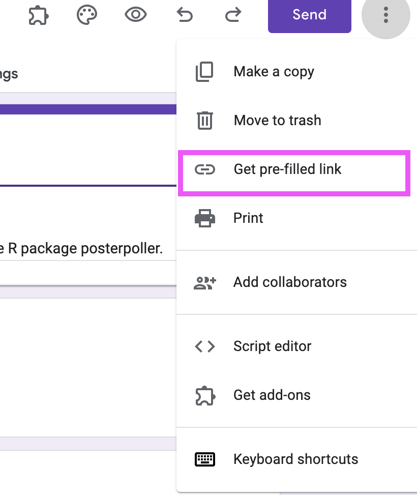
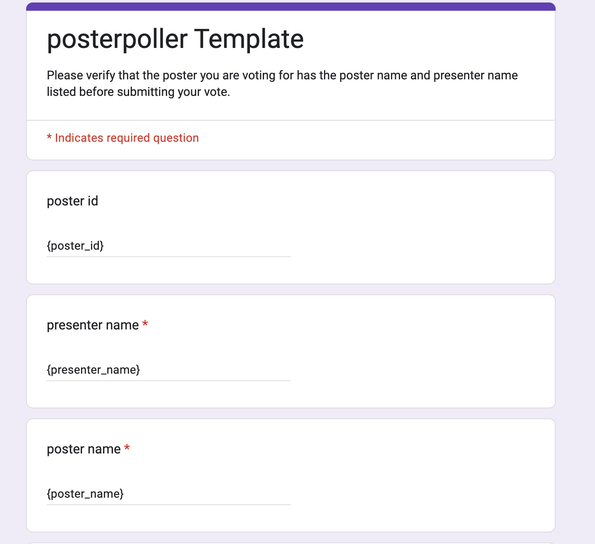

<!-- START doctoc generated TOC please keep comment here to allow auto update -->
<!-- DON'T EDIT THIS SECTION, INSTEAD RE-RUN doctoc TO UPDATE -->
**Table of Contents**  *generated with [DocToc](https://github.com/thlorenz/doctoc)*

- [posterpoller](#posterpoller)
  - [Install the package](#install-the-package)
  - [Set Up](#set-up)
- [Conducting the session](#conducting-the-session)
  - [Example participant voter instructions](#example-participant-voter-instructions)
  - [During the session](#during-the-session)
  - [Calculating the scores](#calculating-the-scores)
  - [Example calculation code:](#example-calculation-code)

<!-- END doctoc generated TOC please keep comment here to allow auto update -->

# posterpoller

opensource polling system for poster competitions or other things!

You can [read the posterpoller package documentation here](https://hutchdatascience.org/posterpoller/).

## Install the package

You can install `posterpoller` using the `remotes` package to install from GitHub.

```
if (!("remotes" %in% installed.packages())) {
  install.packages("remotes")
}

remotes::install_github("fhdsl/posterpoller")
```

Then you'll need to load the library.

```
library(posterpoller)
```

## Set Up

1. Create a Googlesheet that has the `poster_title` and `presenter_name` as columns:

[See example here](https://docs.google.com/spreadsheets/d/12aomFyT0zEHNmpyCQoGdDh16P-bRp4Pkt4PCCrU7gYY/edit#gid=0)

Declare it here.

```
poster_googlesheet <- "https://docs.google.com/spreadsheets/d/12aomFyT0zEHNmpyCQoGdDh16P-bRp4Pkt4PCCrU7gYY/edit#gid=0"
```


2. We'll read in the poster googlesheet to check that we can find it. You'll have to sign in to Google.  

```
googlesheets4::read_sheet(poster_googlesheet)
```

3. Make a copy of this google form: https://docs.google.com/forms/d/1x2QwyztUMaL0mVFRN4Ds6fThnpJJ_z-FzLvfvHlbZ7M/edit

4. Change the description and title as needed.

5. In the opened window of the new poll you created, click the vertical "..." for `More options` and choose "Get prefill link".



In this screen, put `{poster_id}` and `{poster_title}` and `{presenter_name}` as the responses respectively.



Then click "Get Link" on the bottom.

There will be a tiny pop up at the bottom left that says "COPY LINK". Click that button.


Copy and paste this URL below to declare as an R object. It should look something like the example below. We'll need this for the next step.

```{r eval = FALSE}
prefill_url <- "https://docs.google.com/forms/d/e/1FAIpQLScPnpDBbXXPSHBnEZeoUjLrx-brFq-bHl5cvQIkeEbDoKROIA/viewform?usp=pp_url&entry.38519462=%7Bposter_id%7D&entry.2095768008=%7Bpresenter_name%7D&entry.1154882998=%7Bposter_title%7D"
```

6. Run generate `generate_poster_ids()` function by putting your `prefill_url` and `poster_googlesheet` into this function.

Now we can run the function.

```
generate_poster_ids(prefill_url = prefill_url,
                    poster_googlesheet = poster_googlesheet,
                    dest_folder = "qr_codes")
```

By default the PNG qr codes are saved to a folder called `qr_codes` and an additional worksheet with the qr_code info and poster_id info is saved to the googlesheet you read in.

Print these QR codes out and put them to each poster.

# Conducting the session

What you need before the poster session:

- [ ] Printed out QR codes
- [ ] Print out voting instructions

Here's an [example of the voting instructions you can use](https://docs.google.com/presentation/d/15wIBWxdQSJVpHuKJUqfHMAumoD9wFR_3q-xGgKjxsm4/edit#slide=id.p

## Example participant voter instructions

> Open your phone’s camera to scan the voting QR code next to the poster you’d like to vote for.  
Hold the camera with a steady shot of the QR code. You may have to click the image of the QR code.

> Check that the name and poster id on the form that is pulled up matches the poster you are attempting to vote for.
Some QR code readers might not put spaces in the name and title displayed but this will not affect your vote.
If for some reason the QR code can not be found or doesn't work manually enter the presenter's name and poster id at this form: {LINK TO FORM}

> Put your email address you used for the conference registration in the part of the form that says: Email address. (You may ask the info desk if you aren’t sure what email you used.)

> Complete the part of the form that says: On a scale of 1 to 10 how would you rate the clarity of scientific communication in this poster presentation? Where 1 is Unclear and 10 is Perfectly clear

> (Optional) You can leave a nice comment or suggestion in the section that says: Any additional comments about this poster presentation?

> Click submit.

> Do this for each poster you visit!

## During the session

- Monitor data collection
- Be available for questions and any troubleshooting.

## Calculating the scores

We calculated the scores in R.

We ended up using this calculation for the score:
```
log2(num_votes + 1)*mean_score*distinct_domain)
```
The mean highest rating was important but this made sure that the number of votes was weighted. People often vote 10s for all posters which means we needed a way to differentiate mean scores of 10. Additionally the `distinct_domain` aspect makes sure that there is no "home court advantage" for anyone. Basically if individuals from a number of universities all agreed your poster was good that was more valuable then if all your votes came from the same institution (which is likely your lab or colleagues).


## Example calculation code:

```r
votes_df <- googlesheets4::read_sheet(<sheet_link here>) %>%
  janitor::clean_names() %>%
  dplyr::rename(email = email_address_conference_registration_email_address_must_be_used,
                score = on_a_scale_of_1_to_10_how_would_you_rate_the_clarity_of_scientific_communication_in_this_poster_presentation)
```

Account for spaces sometimes being trimmed by some QR code readers:

```{r}
votes_df <- votes_df %>%
  dplyr::mutate(presenter_name = gsub(" ", "", trimws(presenter_name)),
                poster_title = gsub(" ", "", trimws(poster_title)))
# Minor formatting fix.
votes_df$poster_id <- unlist(votes_df$poster_id)

```

People may accidentally vote twice. We will keep the most recent vote only.

```r
all_df <- all_df %>%
  dplyr::distinct(poster_id, email, .keep_all = TRUE) %>%
  readr::write_csv("raw_data.csv")

all_df
```

Now tally various types of scores.

```{r}
tally_df <- all_df %>%
  #
  tidyr::separate(email, sep = "@", into = c("email_name", "domain")) %>%
  dplyr::group_by(poster_id, presenter_name) %>%
  dplyr::summarize(mean_score = mean(score),
                   sd = sd(score),
                   num_votes = dplyr::n(),
                   distinct_domain = length(unique(domain)),
                   score = log2(num_votes + 1)*mean_score*distinct_domain) %>%
  dplyr::arrange(desc(distinct_domain), desc(score)) %>%
  readr::write_csv("final_scores.csv")
```
